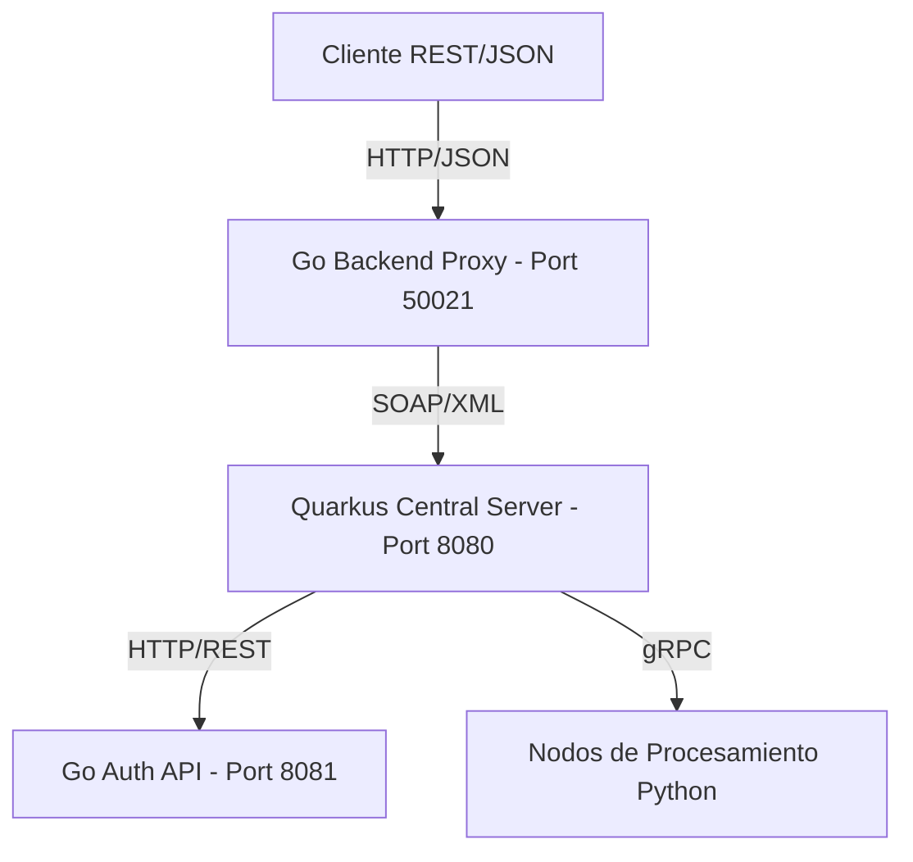

# 🌉 Distributed Systems Backend - API Gateway (Go)

Este servicio actúa como el **API Gateway** central del sistema. Su función principal es servir de puente entre las aplicaciones cliente (REST/JSON) y el Servidor Central (SOAP/XML), permitiendo una comunicación fluida y segura.

## 🏗️ Arquitectura del Sistema

El sistema sigue un flujo de datos en tres capas para garantizar el desacoplamiento:



### Tecnologías Utilizadas
- **Lenguaje:** Go 1.22+
- **Framework Web:** Gin Gonic
- **Protocolos:** REST (Entrada), SOAP (Salida hacia Core)
- **Seguridad:** JWT (Stateless)

---

## 📡 Endpoints de la API

### 🔐 Autenticación (`/api/v1/auth`)

| Método | Endpoint | Descripción |
| :--- | :--- | :--- |
| `POST` | `/login` | Inicia sesión y devuelve un token JWT. |
| `POST` | `/register` | Registra un nuevo usuario en el sistema. |
| `POST` | `/logout` | Invalida la sesión actual (vía Header Auth). |
| `GET`  | `/validate` | Verifica si el token actual es vigente. |
| `POST` | `/forget-password` | Inicia el proceso de recuperación de contraseña. |
| `POST` | `/reset-password` | Cambia la contraseña usando un token de recuperación. |

### 👤 Gestión de Usuarios (`/api/v1/user`)

| Método | Endpoint | Descripción |
| :--- | :--- | :--- |
| `GET` | `/profile` | Obtiene los datos del perfil del usuario autenticado. |
| `PUT` | `/profile` | Actualiza la información del perfil (Nombre, Email, etc). |
| `GET` | `/activity` | Lista las últimas acciones realizadas por el usuario. |
| `GET` | `/search` | Busca otros usuarios en el sistema por UID. |
| `GET` | `/statistics` | Estadísticas de uso (imágenes procesadas, etc). |
| `DELETE` | `/account` | Elimina la cuenta del usuario actual. |

### 🖼️ Procesamiento de Imágenes (`/api/v1/node`)

| Método | Endpoint | Descripción |
| :--- | :--- | :--- |
| `POST` | `/upload` | Envía imágenes y una lista de transformaciones para procesar. |

---

## 🛠️ Estructura del Proyecto

```text
Backend/
├── handlers/    # Controladores (Capa de entrada HTTP)
├── models/      # Definiciones de datos y DTOs
├── repository/  # Adaptadores de salida (Clientes SOAP)
├── services/    # Lógica de negocio y orquestación
├── routes/      # Configuración del enrutador Gin
└── main.go      # Punto de entrada de la aplicación
```

## 🚀 Instalación y Ejecución

1. Asegúrate de tener Go instalado.
2. Clona el repositorio.
3. Instala las dependencias:
   ```bash
   go mod tidy
   ```
4. Ejecuta el servidor:
   ```bash
   go run main.go
   ```
   *El servidor iniciará por defecto en `http://localhost:50021`*